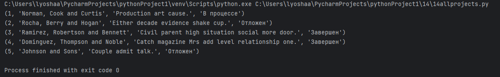
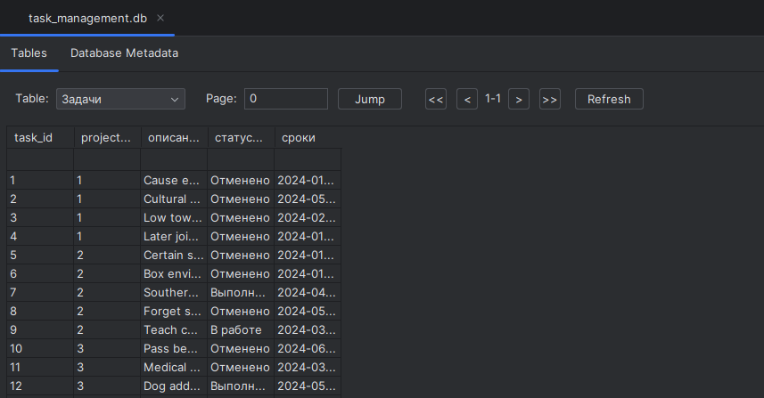

# lab14  

## Задание
    Спроектируйте БД с использованием crow’s foot notation.
    Создайте таблицы БД и заполните данными. Для генерации данных можно использовать сервис https://www.mockaroo.com/.
    Напишите несколько запросов для выборки данных из всех таблиц.
    Оформите отчёт в README.md. Отчёт должен содержать:
        Условия задач
        Описание проделанной работы
        Скриншоты результатов
        Ссылки на используемые материалы
## Проделанная работа
По своему варианту (`2`) я создал бд с тремя таблицами внутри. Для заполнения БД использовал пакет Faker. В конце сделал 3 запроса к БД.

## Скриншоты

## Список использованных источников
[лаба](https://evil-teacher.on.fleek.co/prog_pm/term2/lab14/)
